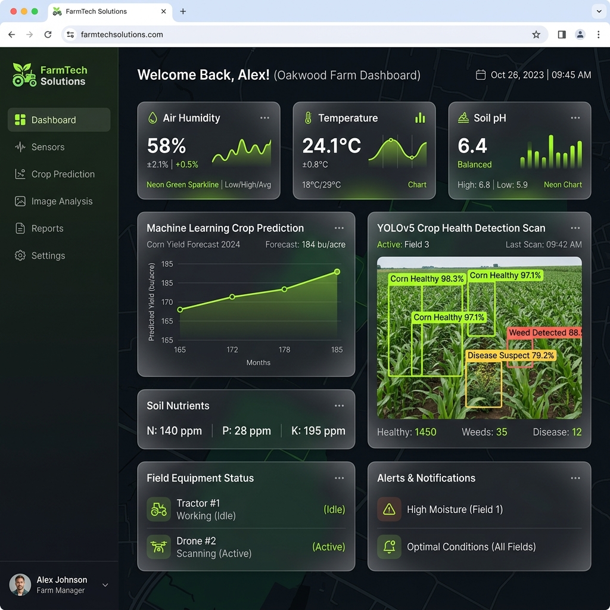
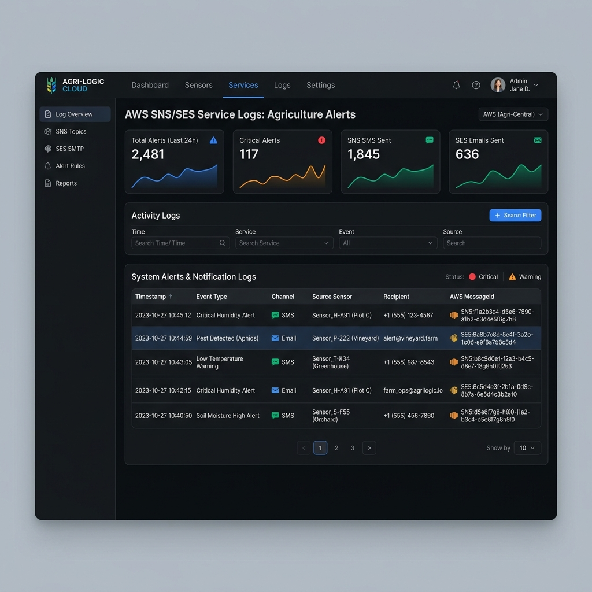

# FIAP - Faculdade de Informática e Administração Paulista

<p align="center">
<a href="https://www.fiap.com.br/"></a>
</p>

<br>

# Sistema de Monitoramento e Previsão de Safra Consolidado (FarmTech Solutions)

## Grupo: FarmTech Solutions

## 👨‍🎓 Integrantes: 
- <a href="https://www.linkedin.com/in/gabriel-oliveira-b6353a16b/">Gabriel Oliveira dos Santos (RM 567166)</a>
- <a href="https://www.linkedin.com/in/roberson-pedrosa-304ab523a/">Roberson Pedrosa de Oliveira Junior (RM 567216)</a>
- <a href="https://www.linkedin.com/in/arthur-bruttel-7171b8381">Arthur Bruttel Nascimento (RM 568484)</a> 
- <a href="https://www.linkedin.com/in/jonviotti/">Jonatan Viotti Rodrigues da Silva (RM 566787)</a> 
- <a href="https://www.linkedin.com/in/eusamuelrocha/">Samuel Nicolas Oliveira Rocha (RM 568552)</a>

## 👩‍🏫 Professores:
### Tutor(a) 
- <a href="https://www.linkedin.com/in/sabrina-otoni-22525519b/">Sabrina Otoni</a>
### Coordenador(a)
- <a href="https://www.linkedin.com/company/inova-fusca">André Godoi Chiovato</a>

---

## 📜 Descrição

O **Ecossistema Digital Consolidado da FarmTech Solutions** é uma plataforma avançada de agricultura de precisão que unifica dados meteorológicos, controle de plantio, persistência em banco de dados corporativo, monitoramento IoT em tempo real, análises preditivas com Machine Learning, mensageria AWS e visão computacional (YOLOv5).

O objetivo do projeto é mitigar a fragmentação de ferramentas digitais no campo, fornecendo ao produtor rural uma central de comando unificada (Dashboard Streamlit) que integra e consolida os resultados desenvolvidos ao longo das Fases 1 a 6.

### 🌟 Detalhamento das Fases Integradas (Fases 1 a 7)

*   **Fase 1 - Clima e Manejo de Plantio**: Integração da API pública *Open-Meteo* para consultas climáticas em tempo real e formulários interativos de cálculo de manejo e insumos para culturas de cana-de-açúcar e laranja. Inclui a execução de análises estatísticas em linguagem **R** (`analise.R`) via subprocesso em Python, calculando médias e desvios-padrão dos CSVs exportados com suporte a um mecanismo de fallback estatístico robusto (Pandas) caso o interpretador R não esteja instalado.
*   **Fase 2 - Banco de Dados & CRUD**: Gerenciamento completo de propriedades e colheitas (SMPC) com suporte a banco de dados relacional (Oracle DB via biblioteca `oracledb`). Oferece listagem de registros, inserção de propriedades, relatório consolidado de perdas com tabelas e gráficos, além de funcionalidade gráfica de backup e restauração local via arquivos JSON estruturados.
*   **Fase 3 - Monitoramento IoT**: Monitoramento em tempo real de telemetria simulada do microcontrolador ESP32 (temperatura, umidade do solo, luminosidade e pH) com conexão assíncrona ao broker MQTT público (`broker.hivemq.com` no tópico `farmtech/sensores`). Implementa a lógica de acionamento automático da bomba de irrigação quando a umidade do solo cai abaixo do limiar crítico de 30%.
*   **Fase 4 - Predições de Machine Learning**: Módulo de IA que realiza previsões de produtividade de colheita com base em dados de solo e clima (Nitrogênio, Fósforo, Potássio, Temperatura, Umidade, pH e Pluviosidade) utilizando o modelo preditivo *Random Forest* (carregado de forma otimizada via arquivo serializado `model.joblib`).
*   **Fase 5 - Alertas Cloud & AWS**: Central de notificações integrada à nuvem utilizando a biblioteca `moto` (Moto Mock) para emulação local dos serviços *AWS SNS* e *AWS SES*. Permite o disparo de e-mails e SMS automáticos quando regras críticas de sensores (umidade < 30%) ou visão computacional (pragas detectadas) são violadas, exibindo o identificador de mensagem único (`MessageId`) gerado pela AWS.
*   **Fase 6 - Visão Computacional (YOLO)**: Pipeline de inferência baseado no framework Ultralytics YOLOv5 (pesos carregados de `best.pt` com cache inteligente) para diagnóstico fitossanitário. O produtor faz o upload de imagens de folhas e a rede detecta pragas ou anomalias, gerando bounding boxes detalhadas e enviando automaticamente notificações de alerta AWS críticas para pragas diagnosticadas.
*   **Fase 7 - Dashboard Geral (Integração)**: A interface consolidada Streamlit que unifica todas as fases anteriores sob um layout moderno de alto impacto estético, painéis do tipo Bento Grid no dashboard principal e navegação dinâmica.

---

### 🖥️ Capturas de Tela do Dashboard em Funcionamento

#### 📁 Painel Central de Controle (Dashboard Consolidado)
O painel inicial consolida os status e atalhos rápidos de todas as fases, fornecendo uma visão 360º de toda a fazenda em um tema visual premium e glassmorphic.



#### ☁️ Central de Alertas e logs do Serviço de Mensageria (AWS SNS/SES)
Interface que registra e exibe o histórico de disparos SMS e SES mockados pela AWS para avisar os administradores sobre anomalias críticas de umidade e detecções de pragas.



---

### 🎥 Vídeos Demonstrativos do Projeto
Confira abaixo os links das demonstrações práticas e de arquitetura:
- 📺 **[Execução de Código e Análise de Dados (Jupyter Notebook)](https://youtu.be/lI096I3a-KI)**
- 📺 **[Dimensionamento e Estimativa de Custos AWS Calculator](https://youtu.be/IwPJJlkNaDY?si=h9mY4XDt-yoDEiHJ)**
- 📺 **[Sistema de Coleta e Comunicação de Dados (ESP32 IoT)](https://youtu.be/tN_2lrPw9Hg)**

---

## 📁 Estrutura de pastas

Dentre os arquivos e pastas presentes no diretório `dashboard-farmatech/`, definem-se:

- <b>assets/imagens</b>: Contém o logotipo da FIAP e as capturas de tela e mockups da interface em funcionamento.
- <b>config</b>: Contém os scripts de parametrização e conexão de banco de dados (`database.py` e `populate_db.py`).
- <b>R</b>: Contém o script R (`analise.R`) responsável por realizar os cálculos de médias e desvios padrão estatísticos.
- <b>src</b>: Pasta principal com o código de lógica do sistema.
  - <b>src/services</b>: Serviços de integração de alertas AWS SNS/SES (`aws_sns_service.py`) e pipeline YOLOv5 (`yolo_service.py`).
  - <b>src/clima_api.py</b>: Wrapper de chamadas para API Open-Meteo.
  - <b>src/data_generator.py</b>: Simulador de telemetria IoT.
  - <b>src/iot_service.py</b>: Lógica de recepção assíncrona MQTT de telemetria.
  - <b>src/plantio.py</b>: Lógica de negócios e cálculos agrícolas.
  - <b>src/r_executor.py</b>: Wrapper de execução subprocessada de scripts R com fallback estatístico em Pandas.
  - <b>src/smpc_service.py</b>: Lógica de CRUD de colheitas, propriedades e exportação/importação JSON.
- <b>app.py</b>: Arquivo principal de entrada da aplicação Streamlit que gerencia a renderização gráfica das telas.
- <b>backlog.md</b>: Lista de controle e acompanhamento de tarefas do projeto.
- <b>model.joblib</b>: Pesos do modelo preditivo Random Forest (ML) treinado na Fase 4.
- <b>requirements.txt</b>: Arquivo com a especificação de dependências Python para o dashboard.

---

## 🔧 Como executar o código

### Pré-requisitos
1. **Python 3.10 a 3.13** instalado no sistema.
2. **Interpretador R** (opcional - caso não esteja instalado, o sistema usará o pipeline de fallback Python Pandas para exibir as análises estatísticas da Fase 1).
3. Uma IDE moderna instalada (ex: **VS Code** ou **PyCharm**).

### Instalação e Execução Passo a Passo

1. **Clonar o Repositório**:
   ```bash
   git clone https://github.com/samuelnrocha/dashboard-farmatech.git
   cd dashboard-farmatech
   ```

2. **Configurar o Ambiente Virtual (venv)**:
   ```bash
   python -m venv .venv
   # No Linux/macOS:
   source .venv/bin/activate
   # No Windows (Command Prompt):
   .venv\Scripts\activate.bat
   # No Windows (PowerShell):
   .venv\Scripts\Activate.ps1
   ```

3. **Instalar Dependências**:
   ```bash
   pip install -r requirements.txt
   ```

4. **Configurar Variáveis de Ambiente**:
   Renomeie o arquivo `.env.example` para `.env` e ajuste as configurações de conexão (caso necessário) do seu banco de dados:
   ```bash
   cp .env.example .env
   ```

5. **Executar a Aplicação**:
   Inicie o servidor de desenvolvimento do Streamlit para rodar a aplicação localmente:
   ```bash
   streamlit run app.py
   ```
   Acesse a URL gerada no terminal (geralmente `http://localhost:8501`) em seu navegador web de preferência.

---

## 🗃 Histórico de lançamentos

*   **1.0.0 - 06/06/2026**
    *   *Fase 7*: Lançamento do dashboard consolidado Streamlit. Unificação de todos os serviços de climatologia, manejo de plantio, CRUD local/remoto, MQTT IoT, previsões de ML, mensageria AWS e visão computacional YOLO em uma interface única integrada.
*   **0.6.0 - 05/2026**
    *   *Fase 6*: Implementação do módulo de Visão Computacional com detecção fitossanitária de folhas usando YOLOv5 (`best.pt`).
*   **0.5.0 - 04/2026**
    *   *Fase 5*: Configuração da infraestrutura AWS Mockada local com a biblioteca `moto` para e-mail/SMS (SNS/SES).
*   **0.4.0 - 03/2026**
    *   *Fase 4*: Modelagem estatística preditiva de produtividade agrícola com Random Forest.
*   **0.3.0 - 02/2026**
    *   *Fase 3*: Construção da telemetria de sensores de solo e broker de mensagens com protocolo MQTT.
*   **0.2.0 - 01/2026**
    *   *Fase 2*: Persistência relacional em Oracle DB e gerenciamento de perdas na colheita (SMPC).
*   **0.1.0 - 12/2025**
    *   *Fase 1*: Lógica de clima via Open-Meteo, cálculos de plantio e análise estatística R.

---

## 📋 Licença

<p align="left">
<a href="http://creativecommons.org/licenses/by/4.0/?ref=chooser-v1" target="_blank" rel="license noopener noreferrer" style="display:inline-block;"></a>
</p>

O [MODELO GIT FIAP](https://github.com/agodoi/templateFiapVfinal) por [FIAP](https://fiap.com.br) está licenciado sob a Licença Internacional [Creative Commons Attribution 4.0 International](http://creativecommons.org/licenses/by/4.0/?ref=chooser-v1).
